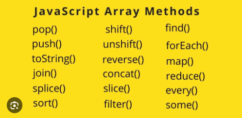

# HOMEWORK
- LOOPS.
- FUNCTIONS.
- ARRAYS.
- ARRAY METHODS.
- OBJECT.

#
>LOOPS
- For.
- While.
- Do While.

#
 1.For.
 
     for(let i=0; i<5; i++){
        console.log('hi')
     }
 
    Men bu yerda ismimni 3 marta yozishni o'rniga for loop(halqa) ga soldim.Amalni bajarishda necha marta oshirilish qiymatini bergiladim,

    hi
    hi
    hi
    hi
    hi
#

2.While

    var a=0;

    while(a<3){
        console.log(a);
        a++;
    }

    0
    1
    2
    3
     While da inkriementni tashqarida yoziladi.Inkriementni yozmasa nima    bo'ladi? Bunda biz amalni    bajarilishi yo'lini ko'rsatmagan bo'lamiz va sonlarni infinite   holatgacha olib borishi mumkin.
#
>FUNCTIONS

- Function decloration
- Function Expression
- Arrow function
#
1.Function Decloration

    function a(){

    }
    a()

    Function Declorationning yaxshi     taraflaridan biri bu functionni     functiondan oldin ham ishlatsak     bo'ladi.

#
2.Function Epression.

    let a = function(){

    }
    a()

    Function Epressionnni o'zgaruvhi ichiga olib yozamiz,uni misollaridan bittasi uni function dan oldin ishlatib bolmaydi , ya'ni functioni tepada yozishga togri keladi , function declaration da esa hohlagan joyda yozib ketish mumkin boladi .
#
3.Arrow function.

    const a =function(){

    }
    a()

    Function arrow function expression bilan deyarli bir xil.Functionlarni pilus laridan biri kamroq kod yoziliadi. ya'nii function() sozi o'rniga “() =>” shuni yozib qoysaq boldi .
    
#
>ARRAY

    Arrayni afzalliklari juda ko'p.
    Chunki array ichiga koplab     ma'lumaotlarni kiritishimiz mumkin
    Arrayni loop larga ham o'xshatish     mumkin faqat biz o'rgangan for,     while, do while loop larida     takrorlanuvchi ma'lumotlar bo'lsa     yoki bir xil ma'lumotlarni     ko'proq formatda yozishda ishlatar     edik.Arraylarda esa har xil turdagi ma'lumotlarni bir array [], ichiga joylab ketishimiz mumkin.
       Array bu Non Primativ bo'lib o'z ichiga bir nechta ma'lumotlar va qiymatlar, xatto primativlar va shularni qiymatlarini takroran tayinlasnishi kabi imkoniyatlarni ko'rishimiz mumkin.
#
Masalan

    var array = ['Amirxon','Xodisaliyev',23,'Andijon']

    console.log(array);

    Agar biz arrayning ichidagi birgini malumotni o;lmoqchi bo'lsak uni index raqami bilan tanlaymiz.Array ichidai ma'lumotlar 0 dan boshlab tartiblanadi.
      Agar bizga ikkinchi malumot kerak bo;lsa biz uni 1 indexi bilan chaqiramiz
      ya'ni:
      console.log(array[1]);

      ['Xodisaliyev']

#

    Konsoleda(terminalda)

    ['Amirxon','Xodisaliyev',23,'Andijon']
## 

>ARRAY METHODS

### Array metodlar bu array ichidiagi malumotlar ustidagi turli xil ammallarni bajarishiga yordam beradi.
- pop - elementni oxiridan o'chiradi.

      <pop>

       const a=["bir','ikki','uch','tort"]

       NATIJA:

       ["bir','ikki','uch'"]
#
- push - elementni oxiriga qo'shadi.

      <push>

       const a=["bir','ikki','uch','tort"]

       a.push('besh');

       NATIJA:

       ["bir','ikki','uch','tort','besh'"]
#
- shift - elementni boshiga qo'shadi.

      <shift>

       const a=["bir','ikki','uch','to'rt'"]

       a.shift();

       NATIJA:

        ["'ikki','uch','to'rt"]
#
- toString - matn qaytaradi.

      <toString>

      const a=["bir','ikki','uch','to'rt'"]

      a.toString();

      NATIJA:

      [bir,ikki,uch,to'rt]
#
- join - massiv elementlarni bir qatoega joylaydi.

      <join>

       const a=["bir','ikki','uch','tort'"]

       a.join('+');

       NATIJA:

       [bir+ikki+uch+tort+]
#
- splice - element olib tashlanmaydi,olingan elementsiz yangi massiv yratadi.

      <splice>

      const a=["bir','ikki','uch','tort"]
      
      a.splice(1)

      NATIJA:

      ["ikki','uch','tort"]

#
- slice - massivdan elementni kesib oladi.

       <slice>

       const a=["bir','ikki','uch','tort"]

       NATIJA:

       a.slice(1,3)

       ["ikki',tort"]

#
- unshift - arrayda  da elementlar sonini qaytaradi.

       <unshift>

       const a=["bir','ikki','uch','tort"]

       NATIJA:

       a.unshift()

       3

#
 - concat - bir nechta massivlarni birlashtiradi. 

       <concat>

       const a=["bir','ikki','uch','tort"]

       const b=["Andijon','Buxoro','Fargona,'Guliston"]
       

       NATIJA:

       const a=b.concat["bir','ikki','uch','tort','Andijon','Buxoro','Fargona','Guliston"]
#

>OBJECT

## Primitive tiplar o’zida qiymatini saqlasa, Objectlar esa o’zida reference saqlaydi.
Yani Java Scripta biz ochgan o'zgaruvchilarimiz CALL STACK va HEAP degan xotira bazasia kelib tushadi va ularni shu yerda saqlaydi.biz ularni o'zgaruvchiga nomlagan nomlarimizni ID (raqamlar)sifatida saqlaydi,ularni biz nomlagan key larimiz bilan chaqirib ishlatamiz.
   Shu tariqa pirimativlar o'zida bir turdai ma'lumotlarni saqlaan bo'lsa u CALL STACK ma'lumotlar bazasida saqlanadi.Non Primativlar esa HEAP da.

#

      const me={
    name:'amirxon',
    age:'23',
    phone:'+998882326622',
    email:'xodisaliyevamirxon@gmail.com',
    isMarried:false,
    adress:{
        citiy:'Andijon',
        tuman:'Jalaquduq',
        code:'2211221144',
    },
    hobby:{
        uyda:['sleeping','TV',],
        kochada:['playing footbal','plov',],  
     },
    all: function(){
        console.log(`
        name:${me.hobby.kochada[0]}
        
        `)
    }
    }
 
#

    Agar biz objectni ichidagi malumotlarni keraklisin chaqirmoqchi  bo'lsak ularni key(type)larini.,
    nomlangan ID.,   index raqami[], 
    kabai ammallar billan ishlatishimiz mumkin. 
   

